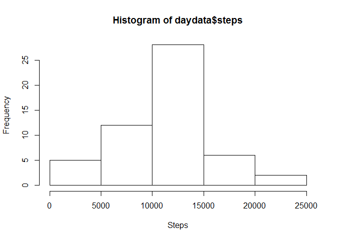
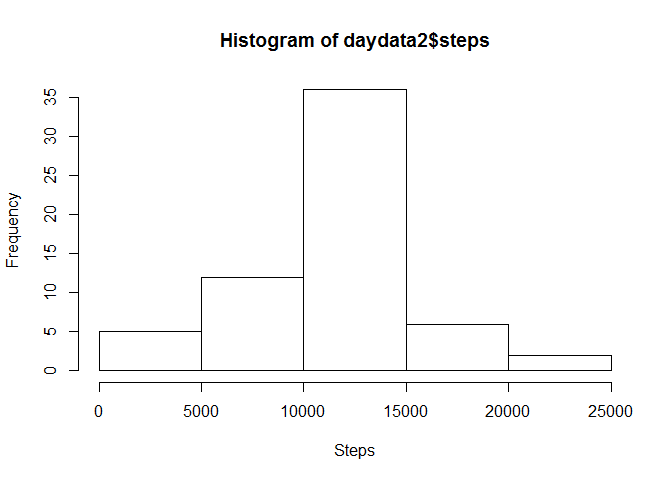
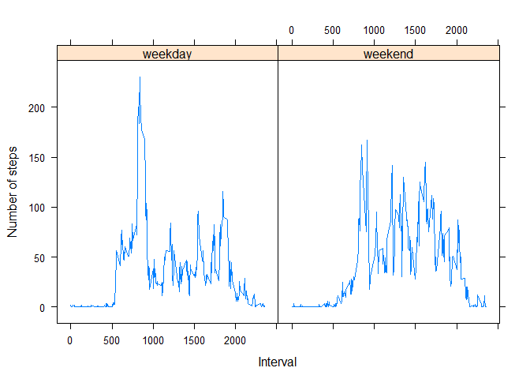

# Reproducible Research: Peer Assessment 1


```r
Sys.setlocale( "LC_TIME", "C" )
library( "plyr" )
library( "lattice" )
```


## Loading and preprocessing the data

Load the data and convert the date column into date data type.

```r
unzip( "activity.zip" )
data  <- read.csv( "activity.csv" )
data$date <- as.Date( data$date )
```


## What is mean total number of steps taken per day?

Calculate the total daily steps.

```r
daydata <- aggregate( steps ~ date, data, FUN = sum )
```

Draw a histogram of the daily step amounts.

```r
hist( daydata$steps, xlab = "Steps" )
```

 

Calculate the mean and median number of steps.

```r
mean( daydata$steps )
```

```
## [1] 10766.19
```

```r
median( daydata$steps )
```

```
## [1] 10765
```


## What is the average daily activity pattern?

Calculate the mean number of steps in an interval.

```r
intervaldata <- aggregate( steps ~ interval, data, FUN = mean )
```

Create a time series plot.

```r
plot( intervaldata$interval, intervaldata$steps, type = "l", 
     xlab = "Interval", ylab = "Steps" )
```

 

Find the interval containing maximum average number of steps.

```r
intervaldata[ max( intervaldata$steps ) == intervaldata$steps, ]
```

```
##     interval    steps
## 104      835 206.1698
```


## Imputing missing values

Missing values is the TRUE column.

```r
table( is.na( data$steps ) )
```

```
## 
## FALSE  TRUE 
## 15264  2304
```

Replace the missing values with the mean for that interval. First join 
the new data frame with the interval mean data. Then replace the missing values 
with the mean found in the fourth column of the joined data frame. The replaced 
values are rounded to nearest integer.

```r
data2 <- data
data2$steps[ is.na( data2$steps ) ]  <- as.integer( round( join( data2, intervaldata, 
      by = "interval" )[ is.na( data2$steps ), 4 ] ), 0 )
```

Draw a histogram of the daily step amounts.

```r
daydata2 <- aggregate( steps ~ date, data2, FUN = sum )
hist( daydata2$steps, xlab = "Steps" )
```

 

Calculate the mean and median number of steps.

```r
mean( daydata2$steps )
```

```
## [1] 10765.64
```

```r
median( daydata2$steps )
```

```
## [1] 10762
```


## Are there differences in activity patterns between weekdays and weekends?

Create a factor separating weekend from weekdays.

```r
data2$day[ weekdays( data2$date ) %in% c( "Saturday", "Sunday" ) ] <- "weekend"
data2$day[ is.na( data2$day ) ] <- "weekday"
data2$day  <- as.factor( data2$day )
```

Calculate the mean number of steps in an interval.

```r
intervaldata2 <- ddply( data2, .( interval, day ), summarise, mean( steps ) )
names( intervaldata2 )[ 3 ] <- "steps"
```


Plot the differences.

```r
xyplot( steps ~ interval | day, intervaldata2, type = "l", xlab = "Interval", 
        ylab = "Number of steps" )
```

 
