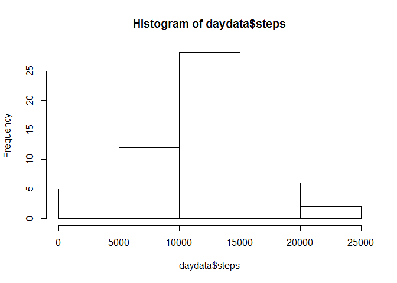

# Reproducible Research: Peer Assessment 1


## Loading and preprocessing the data

Load the data and convert the data column into date data type.


```r
unzip("activity.zip")
data  <- read.csv("activity.csv")
data$date <- as.Date(data$date)
```


## What is mean total number of steps taken per day?

Create a data frame summarizing the data to daily level.

```r
daydata <- aggregate(steps ~ date, data, FUN = sum)
```


Draw a histogram of the daily step amounts.

```r
hist(daydata$steps)
```

 

Calculate the mean and median number of steps.

```r
mean(daydata$steps)
```

```
## [1] 10766.19
```

```r
median(daydata$steps)
```

```
## [1] 10765
```


## What is the average daily activity pattern?

Create a data frame summarizing the data to interval level.

```r
intervaldata <- aggregate(steps ~ interval, data, FUN = mean)
```


## Imputing missing values


## Are there differences in activity patterns between weekdays and weekends?
